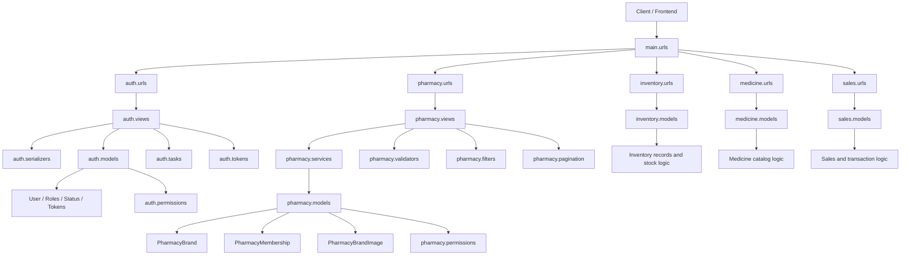

# Auth and Pharmacy App Overview

This document explains what the apps do and lists the main classes and functions defined in each app file.

> Note: generated migration files are omitted because they are database schema history and not business logic.

---

## Project App Tree

This project contains the following Django apps and major project folders:

```text
smf_v1/
├── main/
│   ├── settings.py
│   ├── urls.py
│   ├── asgi.py
│   └── wsgi.py
│
├── auth/
│   ├── admin.py
│   ├── apps.py
│   ├── models.py
│   ├── permissions.py
│   ├── serializers.py
│   ├── signals.py
│   ├── tasks.py
│   ├── tokens.py
│   ├── urls.py
│   ├── views.py
│   ├── tests.py
│   └── migrations/
│
├── pharmacy/
│   ├── admin.py
│   ├── apps.py
│   ├── exceptions.py
│   ├── filters.py
│   ├── models.py
│   ├── pagination.py
│   ├── permissions.py
│   ├── serializers.py
│   ├── services.py
│   ├── validators.py
│   ├── views.py
│   ├── tests.py
│   ├── urls.py
│   └── migrations/
│
├── inventory/
│   ├── admin.py
│   ├── apps.py
│   ├── models.py
│   ├── views.py
│   ├── tests.py
│   └── migrations/
│
├── medicine/
│   ├── admin.py
│   ├── apps.py
│   ├── models.py
│   ├── views.py
│   ├── tests.py
│   └── migrations/
│
├── sales/
│   ├── admin.py
│   ├── apps.py
│   ├── models.py
│   ├── views.py
│   ├── tests.py
│   └── migrations/
│
├── docs/
│   └── auth_and_pharmacy_app_overview.md
│
├── manage.py
├── db.sqlite3
├── requirements.txt
└── README.md (if present)
```

### App responsibilities at a glance

- `auth` — user identity, login, JWT auth, roles, approvals, OTP, email verification, account status, logging
- `pharmacy` — pharmacy brand management, geolocation, membership, verification workflows, access control
- `inventory` — stock/inventory domain, likely product and stock movement management
- `medicine` — medicine catalog and medicine-specific domain logic
- `sales` — sales operations, transactions, and revenue flows
- `main` — project-level configuration, routing, WSGI/ASGI setup, and global settings

---

## Full Project App Map



This map shows that the project is built as a modular Django monolith, where each app owns a specific domain but all apps are wired through the project-level URL config and shared user/auth system.

---

## 1. Auth App

### App purpose
The Auth app is responsible for user identity, authentication, authorization, verification, approval, password management, OTP handling, and activity auditing.

### File-by-file class and function inventory

#### auth/models.py
Classes:
- `UserManager`
  - `create_user(email, password=None, **extra_fields)`
  - `create_superuser(email, password=None, **extra_fields)`
- `User`
  - `__str__()`
  - `get_full_name()`
  - `get_short_name()`
  - `has_perm(perm, obj=None)`
  - `has_module_perms(app_label)`
  - `approve(approver)`
  - `reject(approver)`
  - `requires_approval()`
  - `can_approve_users()`
  - `activate()`
  - `deactivate()`
  - `suspend()`
  - `verify()`
- `EmailVerificationToken`
  - `__str__()`
  - `is_expired()`
  - `use_token()`
  - `is_valid()`
- `PasswordResetToken`
  - `is_expired()`
  - `use_token()`
  - `is_valid()`
- `UserActivityLog`
  - `__str__()`
- `OTPVerification`
  - `__str__()`
  - `is_expired()`
  - `increment_attempts()`
  - `use_otp()`
  - `is_valid()`

Responsibilities:
- Defines the custom user model using email as the username field.
- Stores roles, account status, verification, approval flags, and OAuth metadata.
- Handles professional pharmacy staff approval and ownership logic.

#### auth/permissions.py
Classes:
- `IsAuthenticatedAndActive`
  - `has_permission(request, view)`
- `IsOwnerOrReadOnly`
  - `has_object_permission(request, view, obj)`
- `IsAdminUser`
  - `has_permission(request, view)`
- `IsSuperAdmin`
  - `has_permission(request, view)`
- `IsPharmacyAdmin`
  - `has_permission(request, view)`
- `IsPharmacyStaff`
  - `has_permission(request, view)`
- `IsPharmacyOwner`
  - `has_permission(request, view)`
- `IsApprovedUser`
  - `has_permission(request, view)`

Responsibilities:
- Enforces authentication, role checks, owner-only access, and approval requirements.

#### auth/serializers.py
Classes:
- `UserSerializer`
  - `get_full_name(self, obj)`
- `RegisterSerializer`
  - `validate(self, attrs)`
  - `validate_email(self, value)`
  - `validate_phone_number(self, value)`
  - `create(self, validated_data)`
- `LoginSerializer`
  - `validate(self, attrs)`
- `EmailVerificationSerializer`
- `ResendVerificationSerializer`
- `PasswordResetRequestSerializer`
  - `validate_email(self, value)`
- `PasswordResetConfirmSerializer`
  - `validate(self, attrs)`
- `TokenRefreshSerializer`
- `SocialAuthSerializer`
  - `validate_email(self, value)`
- `ChangePasswordSerializer`
  - `validate(self, attrs)`
- `UpdateProfileSerializer`
  - `validate_phone_number(self, value)`
- `OTPRequestSerializer`
- `OTPVerifySerializer`
- `UserApprovalSerializer`
- `PendingUsersSerializer`

Responsibilities:
- Validates registration, login, password reset, OTP, profile update, and authorization actions.
- Formats and normalizes user data before saving.

#### auth/views.py
Classes:
- `RegisterView`
  - `create(self, request, *args, **kwargs)`
  - `perform_create(self, serializer)`
  - `get_client_ip(self, request)`
  - `get_user_agent(self, request)`
- `LoginView`
  - `post(self, request)`
  - `get_client_ip(self, request)`
  - `get_user_agent(self, request)`
- `SocialAuthView`
  - `post(self, request)`
  - `get_client_ip(self, request)`
  - `get_user_agent(self, request)`
- `LogoutView`
  - `post(self, request)`
- `TokenRefreshView`
- `MeView`
- `UpdateProfileView`
- `ChangePasswordView`
- `EmailVerificationView`
- `ResendVerificationView`
- `PasswordResetRequestView`
- `PasswordResetConfirmView`
- `OTPRequestView`
- `OTPVerifyView`
- `PendingUsersView`
- `ApproveUserView`
- `MyPharmacyStaffView`
- `PendingApprovalCountView`

Responsibilities:
- Handles API endpoints for registration, login, logout, JWT refresh, verification, reset flows, OTP, and user approval actions.

#### auth/tokens.py
Functions:
- `generate_email_verification_token(user)`
- `generate_password_reset_token(user)`
- `get_email_verification_token(user)`
- `get_password_reset_token(user)`
- `generate_otp(user, otp_type, length=6, expiry_minutes=10)`
- `verify_otp(user, otp_code, otp_type)`

Classes:
- `OTPRequestView`
  - `post(self, request)`
  - `get_client_ip(self, request)`
  - `get_user_agent(self, request)`
- `OTPVerifyView`
  - `post(self, request)`

Responsibilities:
- Generates secure tokens, OTPs, and validates them for email verification, password recovery, and account verification tasks.

#### auth/tasks.py
Functions:
- `_frontend_url(path)`
- `send_verification_email(user_id, token)`
- `send_password_reset_email(user_id, token)`
- `cleanup_expired_tokens()`
- `send_otp_email(user_id, otp_code, otp_type)`
- `send_otp_sms(user_id, otp_code)`
- `send_approval_notification(user_id, action)`
- `send_approval_request_notification(owner_id, new_user_id)`

Responsibilities:
- Sends verification emails, password reset links, OTP messages, and approval-related notifications asynchronously through Celery.

#### auth/admin.py
Classes:
- `UserAdmin`
  - `get_full_name(self, obj)`
- `EmailVerificationTokenAdmin`
- `PasswordResetTokenAdmin`
- `UserActivityLogAdmin`
- `OTPVerificationAdmin`

Responsibilities:
- Exposes auth models in Django admin for user management and activity review.

#### auth/signals.py
Functions:
- `assign_user_permissions(sender, instance, created, **kwargs)`
- `create_user_activity_log(sender, instance, created, **kwargs)`

Responsibilities:
- Provides hooks for user permission setup and activity logging on user creation.

#### auth/urls.py
Routes defined:
- `register/`
- `login/`
- `logout/`
- `token/refresh/`
- `me/`
- `profile/`
- `change-password/`
- `verify-email/`
- `resend-verification/`
- `password/reset/`
- `password/reset/confirm/`
- `otp/request/`
- `otp/verify/`
- `oauth/`
- `pending-users/`
- `approve-user/`
- `my-staff/`

Responsibilities:
- Exposes the authentication and user management API endpoints.

### Auth app summary
The Auth app handles:
- user registration and authentication
- JWT-based login and refresh
- email verification and password reset
- OTP verification
- pharmacy staff approval workflows
- custom roles and permissions
- user activity audit logs

---

## 2. Pharmacy App

### App purpose
The Pharmacy app is responsible for pharmacy business data, pharmacy registration, brand verification, location-based discovery, and staff membership management within a pharmacy.

### File-by-file class and function inventory

#### pharmacy/models.py
Classes:
- `PharmacyBrand`
  - `__str__()`
  - `submit_for_verification()`
  - `set_under_review()`
  - `approve(approver)`
  - `reject(approver, reason='')`
  - `suspend(approver, reason='')`
  - properties: `latitude`, `longitude`, `is_verified`, `is_awaiting_verification`
- `PharmacyMembership`
  - `__str__()`
  - `approve(approver)`
  - `reject(approver, reason='')`
  - properties: `latitude`, `longitude`, `is_verified`, `is_awaiting_verification`
- `PharmacyBrandImage`
  - `__str__()`

Responsibilities:
- Stores the pharmacy business entity and its metadata.
- Stores memberships linking users to pharmacies with a role and status.
- Stores uploaded pharmacy media, including a primary image constraint.

#### pharmacy/services.py
Functions:
- `create_pharmacy_brand(owner, **data)`
- `approve_pharmacy_brand(brand, approver)`
- `reject_pharmacy_brand(brand, approver, reason='')`
- `create_membership_request(user, pharmacy, role)`
- `approve_membership(membership, approver)`
- `reject_membership(membership, approver)`
- `suspend_membership(membership, approver)`

Responsibilities:
- Encapsulates commerce/business rules for creating pharmacies, verifying them, and approving or rejecting memberships.

#### pharmacy/permissions.py
Classes:
- `IsSuperAdmin`
  - `has_permission(request, view)`
- `IsPlatformAdmin`
  - `has_permission(request, view)`
- `IsPharmacyOwner`
  - `has_object_permission(request, view, obj)`
- `IsPharmacyOwnerOrPlatformAdmin`
  - `has_object_permission(request, view, obj)`
- `IsApprovedPharmacyMember`
  - `has_object_permission(request, view, obj)`
- `IsPharmacyMemberOrPlatformAdmin`
  - `has_object_permission(request, view, obj)`

Responsibilities:
- Controls who can manage a pharmacy, verify it, or access pharmacy-only endpoints.

#### pharmacy/serializers.py
Classes:
- `PharmacyBrandListSerializer`
- `PharmacyBrandDetailSerializer`
  - `get_owner(self, obj)`
- `PharmacyBrandCreateSerializer`
  - `create(self, validated_data)`
- `PharmacyBrandUpdateSerializer`
  - `validate(self, attrs)`
- `PharmacyBrandImageSerializer`
- `PharmacyMembershipSerializer`
  - `validate_role(self, value)`
  - `validate(self, attrs)`
  - `create(self, validated_data)`
- `PharmacyMembershipRequestSerializer`
  - `get_user(self, obj)`
- `PharmacyMembershipApprovalSerializer`
  - `validate_status(self, value)`

Responsibilities:
- Serializes pharmacy records and validates membership creation and role assignments.

#### pharmacy/views.py
Classes:
- `PharmacyBrandViewSet`
  - `get_serializer_class(self)`
  - `get_permissions(self)`
  - `get_queryset(self)`
  - `perform_create(self, serializer)`
  - `partial_update(self, request, *args, **kwargs)`
  - `approve(self, request, pk=None)`
  - `reject(self, request, pk=None)`
  - `suspend(self, request, pk=None)`
- `PharmacySearchView`
  - `get_queryset(self)`
- `PharmacyNearbyView`
  - `get(self, request, *args, **kwargs)`
- `PharmacyMembershipViewSet`
  - `get_queryset(self)`
  - `perform_create(self, serializer)`
  - `approve(self, request, pk=None)`
  - `reject(self, request, pk=None)`
  - `suspend(self, request, pk=None)`
- `MyPharmacyView`
  - `get_object(self)`
- `MyMembershipsView`
  - `get_queryset(self)`

Responsibilities:
- Exposes API endpoints for pharmacy creation, listing, searching, nearby lookups, verification actions, and membership workflows.

#### pharmacy/filters.py
Classes:
- `PharmacyBrandFilter`
- `PharmacyMembershipFilter`

Responsibilities:
- Provides queryset filtering for pharmacy brand lists and membership lists.

#### pharmacy/validators.py
Functions:
- `validate_latitude(value)`
- `validate_longitude(value)`
- `validate_radius_km(value)`

Responsibilities:
- Validates geolocation inputs for pharmacy search and nearby queries.

#### pharmacy/admin.py
Classes:
- `PharmacyBrandForm`
  - `__init__(self, *args, **kwargs)`
- `PharmacyBrandAdmin`
  - `get_changeform_initial_data(self, request)`
- `PharmacyBrandImageAdmin`
- `PharmacyMembershipAdmin`

Responsibilities:
- Makes pharmacy records and memberships manageable from the Django admin interface.

#### pharmacy/exceptions.py
Class:
- `PharmacyError`

Responsibilities:
- Custom API exception for pharmacy-specific business errors.

#### pharmacy/pagination.py
Class:
- `StandardResultsSetPagination`

Responsibilities:
- Standardized pagination configuration for pharmacy API responses.

### Pharmacy app summary
The Pharmacy app handles:
- pharmacy brand creation and management
- pharmacy verification and suspension workflows
- pharmacy ownership and staff membership
- pharmacy search and nearby-location discovery
- pharmacy-specific permissions and roles

---

## 3. How the apps interact

The apps are intentionally separated:

- The Auth app answers: “Who is the user and can they authenticate?”
- The Pharmacy app answers: “Which pharmacy does the user belong to, and what pharmacy actions are allowed?”

A typical flow is:
1. A user registers using the Auth app.
2. A pharmacy owner creates a pharmacy in the Pharmacy app.
3. A staff member requests membership to that pharmacy.
4. The pharmacy owner or admin approves that membership.
5. Only approved pharmacy members can access pharmacy-specific features.

This separation keeps user authentication logic independent from pharmacy business logic.

---

## 4. Final summary

### Auth app responsibilities
- authentication
- login/logout
- OTP and verification
- password reset
- user roles and approval
- account status tracking
- activity logging

### Pharmacy app responsibilities
- pharmacy business registration
- verification and review of brands
- pharmacy-member access control
- search and nearby pharmacy discovery
- pharmacy staff assignment

Together, they provide the complete platform identity and pharmacy operations flow.
